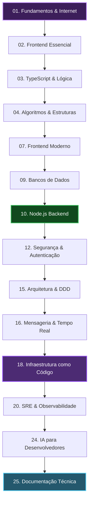

<div align="center">


# 🚀 Formação Engenharia FullStack Gratuita

### Uma formação aberta, gratuita e de nível de produção para dominar desenvolvimento de software.

[](https://www.typescriptlang.org/)
[](https://nodejs.org/)
[](https://nextjs.org/)
[](https://www.docker.com/)
[](https://kubernetes.io/)
[](https://www.terraform.io/)
[](https://aws.amazon.com/)

</div>

---

> [!NOTE]
> **A Formação Engenharia FullStack Gratuita nasce da ideia de estudar ensinando.** 
> A proposta é criar uma trilha longa, sequencial e 100% prática, em que cada aula transforma um assunto complexo em um material claro, consultável e útil tanto para quem acompanha a formação completa quanto para quem busca um tema específico.

---

## 🧠 Foco em Maturidade Técnica

O foco deste repositório não é apenas ensinar ferramentas. A ideia é construir maturidade no desenvolvimento de software de ponta a ponta:
- **Fundamentos Sólidos:** Entender como a internet funciona sob o capô, da infraestrutura física aos protocolos.
- **Engenharia de Qualidade:** Código limpo, testes automáticos de ponta a ponta e observabilidade real de produção.
- **System Design:** Resolver gargalos de latência, disponibilidade, segurança e escalabilidade em nuvem.
- **Inteligência Artificial:** Usar IAs generativas e agentes de forma criteriosa para acelerar o aprendizado e a produtividade, sem terceirizar o raciocínio clínico.

---

## 🗺️ A Jornada do Aprendizado

A formação foi estruturado para ser uma jornada lógica, que guia você do zero absoluto até a operação de sistemas complexos:



---

## 🚀 Trilha da Formação

Abaixo está o mapa detalhado de cada módulo técnico da formação. Cada diretório contém os roteiros, resumos e prompts de estudo guiados por inteligência artificial. Para ver de forma detalhada veja o **[Currículo](curriculo.md)**

| Módulo | Tema | Foco de Aprendizado | Status |
| :---: | :--- | :--- | :---: |
| **00** | [☕ Introdução](modulos/00-introducao-e-metodo-de-estudo/) | Como usar a formação, ter consistência de estudos e aproveitar a IA para aprender. | `Pronto` |
| **01** | [🌐 Fundamentos Web](modulos/01-fundamentos-da-internet-e-web/) | Internet, protocolos HTTP/HTTPS, roteamento, DNS, browsers e fluxo de requisição. | `Rascunho` |
| **02** | [🎨 Frontend Essencial](modulos/02-frontend-essencial/) | HTML5, CSS3 sem frameworks, cascata, layout (Flex/Grid), acessibilidade e responsividade. | `Rascunho` |
| **03** | [📘 TypeScript](modulos/03-programacao-com-typescript/) | JavaScript moderno, TypeScript, tipagem estática, interfaces, generics e assincronismo. | `Rascunho` |
| **04** | [📐 Algoritmos](modulos/04-algoritmos-e-estruturas-de-dados/) | Complexidade de algoritmos (Big-O), estruturas de dados essenciais e árvores. | `Rascunho` |
| **05** | [🛠️ Ferramental Dev](modulos/05-ferramentas-de-desenvolvimento/) | Terminal Linux/Mac, Git, GitHub, packages NPM, linters, formatadores e code review. | `Rascunho` |
| **06** | [📦 Engenharia de Produto](modulos/06-engenharia-de-produto/) | Levantamento de requisitos, histórias de usuário, critérios de aceite e feature flags. | `Rascunho` |
| **07** | [⚛️ Frontend Moderno](modulos/07-frontend-moderno/) | React, gerenciamento de estado, hooks, rotas, testes e otimização de performance. | `Rascunho` |
| **08** | [⚡ Next.js Fullstack](modulos/08-nextjs-e-aplicacoes-fullstack/) | App Router, Server Components, SSR, formulários, APIs e deploy na Vercel. | `Rascunho` |
| **09** | [🗄️ Bancos de Dados](modulos/09-bancos-de-dados/) | SQL vs NoSQL, modelagem de dados, transações ACID, índices, backups e migrations. | `Rascunho` |
| **10** | [🟢 Node.js Backend](modulos/10-backend-com-nodejs/) | Express/Fastify, bancos de dados relacionais, ORMs (Prisma), mensageria e performance. | `Rascunho` |
| **11** | [🔌 API Design](modulos/11-api-design-profissional/) | Design profissional de APIs REST, paginação, filtros, erros padronizados e idempotência. | `Rascunho` |
| **12** | [🔒 Segurança e Auth](modulos/12-autenticacao-autorizacao-e-seguranca/) | JWT, OAuth, hashing de senhas, CORS, CSRF, XSS, SQL Injection e OWASP Top 10. | `Rascunho` |
| **13** | [🧪 Qualidade e Testes](modulos/13-qualidade-observabilidade-e-performance/) | Testes unitários/integração, mocks, testes de carga com k6, logs e métricas. | `Rascunho` |
| **14** | [📐 Design de Software](modulos/14-design-de-software/) | Clean Code, SOLID, DRY, YAGNI, Padrões GoF (Criacionais, Estruturais e Comportamentais). | `Rascunho` |
| **15** | [🏗️ Arquitetura](modulos/15-arquitetura-de-software/) | Clean Architecture, DDD, MVC, SOA, Monólitos, Microsserviços e Serverless. | `Rascunho` |
| **16** | [📡 Tempo Real e Filas](modulos/16-tempo-real-e-comunicacao-assincrona/) | WebSocket, SSE, Message Brokers (RabbitMQ/Kafka), BullMQ e processamento assíncrono. | `Rascunho` |
| **17** | [☁️ Cloud Fundamentals](modulos/17-cloud-fundamentals/) | VPCs, redes, IAM, storages, bancos gerenciados, CDNs, FinOps e disaster recovery. | `Rascunho` |
| **18** | [⚙️ IaC (Terraform)](modulos/18-infrastructure-as-code/) | Infraestrutura declarativa, gerência de estado no Terraform, drift e variáveis. | `Rascunho` |
| **19** | [🐳 DevOps & Kubernetes](modulos/19-devops-containers-e-kubernetes/) | Pipelines de CI/CD, Docker, conteinerização segura e orquestração com Kubernetes. | `Rascunho` |
| **20** | [🚨 SRE & Operação](modulos/20-sre-operacao-incidentes/) | Monitoramento, SLI/SLO/SLA, incident response, postmortems, runbooks e rollbacks. | `Rascunho` |
| **21** | [🛡️ Supply Chain Security](modulos/21-supply-chain-security-e-secure-sdlc/) | Varreduras SAST/DAST, auditoria de dependências, SBOM e assinaturas de artefatos. | `Rascunho` |
| **22** | [🔐 Privacidade & LGPD](modulos/22-privacidade-e-governanca-de-dados/) | LGPD/GDPR para desenvolvedores, anonimização, logs de auditoria e exclusão de dados. | `Rascunho` |
| **23** | [🏛️ System Design](modulos/23-system-design/) | Padrões de consistência/disponibilidade, Caching distribuído, resiliência e circuit breakers. | `Rascunho` |
| **24** | [🤖 IA para Devs](modulos/24-ia-para-desenvolvedores/) | IA Generativa, engenharia de prompt, Agentes autônomos, RAG, Evals e LLMOps. | `Rascunho` |
| **25** | [📝 Documentação](modulos/25-documentacao-tecnica/) | Escrita técnica, ADRs, RFCs, HLD, LLD, modelagem visual com C4 Model e diagramação. | `Rascunho` |

---

## 🐾 O Projeto Prático: PetCare OS

Toda a sua evolução será aplicada na construção do **[PetCare OS](desafio/README.md)**. O projeto evolui com você: 
Começaremos escrevendo telas em HTML/CSS estático, passaremos por lógica em TypeScript, API estruturada em Clean Architecture com Nest.js, persistência dupla (PostgreSQL + MongoDB), filas BullMQ, WebSockets, implantação em Kubernetes usando Terraform e integração de IA generativa com RAG.

> [!TIP]
> Confira os detalhes completos e o mapa de evolução do projeto na **[página de especificação do desafio](desafio/README.md)**.

---

## 📂 Organização do Repositório

```text
.
├── README.md               # Este arquivo (visão geral)
├── curriculo.md            # Matriz curricular completa
├── estrutura-do-repositorio.md # Organização editorial planejada
├── desafio/
│   └── README.md           # Desafio prático do PetCare OS
├── templates/
│   ├── aula.md             # Modelo de roteiro de aula
│   ├── modulo.md           # Modelo de descrição de módulo
│   └── prompt-ia.md        # Modelo de prompt de revisão
└── modulos/
    └── [00-25]-...         # Diretórios de conteúdo
```

---

## 🛡️ Princípios Editoriais

- **Direto ao Ponto:** Sem rodeios ou excesso de texto desnecessário.
- **Estrutura de Consulta:** Cada aula foi desenhada como um manual individual simples de acessar no futuro.
- **Exercícios e Práticas:** Toda aula acompanha sugestões de testes manuais e prompts de IA estruturados para fixação de conhecimento.

---

<div align="center">
Desenvolvido com 💜 para a comunidade de tecnologia.
</div>
