# 🎓 Currículo — Formação Engenharia FullStack Gratuita

Este currículo organiza a mega formação em uma sequência única, indo do absoluto zero até tópicos avançados de desenvolvimento fullstack, arquitetura, infraestrutura, system design e IA para desenvolvedores.

A organização abaixo é uma matriz macro. Cada módulo tem uma pasta própria no repositório e poderá receber aulas, exercícios e prompts de estudo conforme a formação avançar.

## Modelo Pedagógico

A formação usa dois tipos de aula:

- **Aula guarda-chuva:** apresenta um tema amplo, sua importância, vocabulário, relações e mapa mental.
- **Aula específica:** aprofunda um assunto isolado, com exemplos, casos de uso e exercícios.

Exemplo:

```text
Algoritmos de ordenação
- Bubble Sort
- Insertion Sort
- Selection Sort
- Merge Sort
- Quick Sort
- Heap Sort
```

A aula guarda-chuva prepara o terreno. As aulas específicas viram material de consulta e aprofundamento.

## Matriz Curricular Macro

```mermaid
graph TD
    classDef default fill:#1e1e24,stroke:#3178C6,stroke-width:2px,color:#fff;
    classDef phase1 fill:#2b1d3a,stroke:#a154ff,stroke-width:2px,color:#fff;
    classDef phase2 fill:#14301d,stroke:#3cd070,stroke-width:2px,color:#fff;
    classDef phase3 fill:#113a4a,stroke:#3ba7d0,stroke-width:2px,color:#fff;
    classDef phase4 fill:#4a3211,stroke:#d08f3b,stroke-width:2px,color:#fff;
    classDef phase5 fill:#5c2542,stroke:#d03b88,stroke-width:2px,color:#fff;
    classDef phase6 fill:#1c1e3a,stroke:#5c54ff,stroke-width:2px,color:#fff;
    classDef phase7 fill:#3a1c2d,stroke:#ff548b,stroke-width:2px,color:#fff;
    classDef phase8 fill:#24586d,stroke:#5ad5ff,stroke-width:2px,color:#fff;

    subgraph F1[Fase 1: Fundamentos & Frontend Base]
        M00[00. Introdução & Estudo] --> M01[01. Fundamentos da Internet]
        M01 --> M02[02. Frontend Essencial]
    end

    subgraph F2[Fase 2: Lógica & Ferramental]
        M03[03. Programação com TypeScript] --> M04[04. Algoritmos & Estruturas]
        M04 --> M05[05. Ferramental Dev]
        M05 --> M06[06. Engenharia de Produto]
    end

    subgraph F3[Fase 3: Frontend Moderno & Next.js]
        M07[07. Frontend Moderno - React] --> M08[08. Next.js Fullstack]
    end

    subgraph F4[Fase 4: Backend, Bancos & Segurança]
        M09[09. Bancos de Dados] --> M10[10. Node.js Backend]
        M10 --> M11[11. API Design Profissional]
        M11 --> M12[12. Segurança & Autenticação]
    end

    subgraph F5[Fase 5: Qualidade & Arquitetura]
        M13[13. Qualidade & Testes] --> M14[14. Design de Software]
        M14 --> M15[15. Arquitetura de Software]
        M15 --> M16[16. Tempo Real & Mensageria]
    end

    subgraph F6[Fase 6: Cloud, DevOps & SRE]
        M17[17. Cloud Fundamentals] --> M18[18. IaC - Terraform]
        M18 --> M19[19. DevOps, Containers & K8s]
        M19 --> M20[20. SRE & Operações]
    end

    subgraph F7[Fase 7: Segurança, LGPD & IA]
        M21[21. Supply Chain Security] --> M22[22. Privacidade & LGPD]
        M22 --> M23[23. System Design]
        M23 --> M24[24. IA para Desenvolvedores]
    end

    subgraph F8[Fase 8: Documentação]
        M25[25. Documentação Técnica]
    end

    M02 --> M03
    M06 --> M07
    M08 --> M09
    M12 --> M13
    M16 --> M17
    M20 --> M21
    M24 --> M25

    class M00,M01,M02 phase1;
    class M03,M04,M05,M06 phase2;
    class M07,M08 phase3;
    class M09,M10,M11,M12 phase4;
    class M13,M14,M15,M16 phase5;
    class M17,M18,M19,M20 phase6;
    class M21,M22,M23,M24 phase7;
    class M25 phase8;
```




---


## 🚀 Fase 1: Fundamentos & Frontend Base


### 00. Introdução e Método de Estudo

> **Objetivo:** apresentar o projeto, alinhar expectativas e ensinar a estudar com aulas, documentação, prática e IA.


<details>
<summary>🔍 Ver Grade de Assuntos Detalhados</summary>

- Contexto do projeto
- Como estudar com as aulas
- Como usar IA para estudar sem terceirizar o raciocínio
- Como montar caderno de estudo, revisão e prática
- Como usar este repositório

</details>


### 01. Fundamentos da Internet e da Web

> **Objetivo:** entender o ambiente onde aplicações web existem.


<details>
<summary>🔍 Ver Grade de Assuntos Detalhados</summary>

- Internet
- Protocolos
- DNS
- Servidores
- HTTP
- Cache HTTP
- Browsers
- Frontend e backend como papéis na web
- Cliente, servidor, request, response e estado

</details>


### 02. Frontend Essencial

> **Objetivo:** construir a base visual e interativa da web antes de frameworks.


<details>
<summary>🔍 Ver Grade de Assuntos Detalhados</summary>

- HTML
- Semântica HTML
- Formulários
- CSS
- Cascata, especificidade e herança
- Convenções de nomenclatura
- Layout
- Responsividade
- JavaScript no browser
- DOM
- Eventos
- Acessibilidade
- Browsers e compatibilidade

</details>


## ⚙️ Fase 2: Lógica, TypeScript & Ferramental


### 03. Programação com TypeScript

> **Objetivo:** usar TypeScript como base de linguagem para o restante da formação.


<details>
<summary>🔍 Ver Grade de Assuntos Detalhados</summary>

- JavaScript moderno
- Assincronismo em JavaScript
- Event loop
- Tratamento de erros
- TypeScript
- Sintaxe
- Tipos primitivos
- Estruturas de controle
- Inferência
- Compatibilidade de tipos
- Narrowing
- Funções
- Interfaces
- Types
- Classes
- Módulos
- Generics
- Decorators
- Utility types
- Tipos avançados
- Programação orientada a objetos básica
- Promises e async/await

</details>


### 04. Algoritmos e Estruturas de Dados

> **Objetivo:** desenvolver raciocínio computacional e vocabulário técnico para resolver problemas.


<details>
<summary>🔍 Ver Grade de Assuntos Detalhados</summary>

- Estruturas de dados
- Arrays
- Linked lists
- Queues
- Stacks
- Hash tables
- Complexidade de algoritmos
- Tempo vs espaço
- Como calcular complexidade
- Algoritmos de ordenação
- Bubble Sort
- Merge Sort
- Insertion Sort
- Quick Sort
- Selection Sort
- Heap Sort
- Algoritmos de busca
- Busca linear
- Busca binária
- Árvores
- Árvore binária
- Árvore de busca binária

</details>


### 05. Ferramentas de Desenvolvimento

> **Objetivo:** dominar o fluxo básico de trabalho de um desenvolvedor profissional.


<details>
<summary>🔍 Ver Grade de Assuntos Detalhados</summary>

- Editor/IDE e produtividade
- Terminal e linha de comando
- Shell básico
- VCS
- Git
- VCS hosting
- GitHub
- Gerenciadores de pacote
- npm, pnpm e yarn
- Versionamento semântico
- Linter e formatters
- Module bundlers
- Ambientes de desenvolvimento
- Variáveis de ambiente
- Documentação mínima de projeto
- Code review

</details>


### 06. Engenharia de Produto

> **Objetivo:** entender problema, contexto e entrega antes de transformar uma ideia em implementação.


<details>
<summary>🔍 Ver Grade de Assuntos Detalhados</summary>

- Requisitos
- Histórias de usuário
- Critérios de aceite
- Feature flags
- Experimentos e A/B testing

</details>


## ⚛️ Fase 3: Frontend Moderno & Next.js


### 07. Frontend Moderno

> **Objetivo:** construir interfaces modernas com bibliotecas, frameworks e boas práticas.


<details>
<summary>🔍 Ver Grade de Assuntos Detalhados</summary>

- Frameworks e libs frontend
- React
- Componentes
- Renderização
- Hooks
- Rotas
- Gerenciamento de estado
- Chamadas de API
- Formulários
- Validação
- Testes em frontend
- Performance no frontend
- Web Components
- SPA vs PWA
- Module Federation
- Micro-frontends

</details>


### 08. Next.js e Aplicações Fullstack no Frontend

> **Objetivo:** usar Next.js como ponte entre frontend moderno, backend-for-frontend e renderização no servidor.


<details>
<summary>🔍 Ver Grade de Assuntos Detalhados</summary>

- Next.js
- Estratégias de renderização
- Server Components
- Client Components
- Rotas
- Layouts
- Loading states
- Error boundaries
- Suspense
- Formulários
- Tipos e validação
- Chamadas de API
- Autenticação no contexto frontend
- Animações
- Deploy de aplicações Next.js

</details>


## 🟢 Fase 4: Backend, Bancos & Segurança


### 09. Bancos de Dados

> **Objetivo:** entender persistência, modelagem e uso prático de bancos relacionais e não relacionais.


<details>
<summary>🔍 Ver Grade de Assuntos Detalhados</summary>

- SQL e NoSQL
- Modelagem de dados
- SQL básico
- JOIN queries
- Subqueries
- Funções avançadas
- Views
- Indexes
- Transactions
- Integridade de dados
- Segurança
- Stored procedures e functions
- Performance optimization
- SQL avançado
- Migrations
- Backup e restore
- NoSQL básico
- MongoDB
- Conceitos úteis
- Operadores de query
- Aggregation
- Transactions
- Scaling
- Security

</details>


### 10. Backend com Node.js

> **Objetivo:** criar serviços backend usando Node.js com fundamentos sólidos.


<details>
<summary>🔍 Ver Grade de Assuntos Detalhados</summary>

- Node.js
- Runtime
- Event loop no Node.js
- Módulos
- CLI
- Frameworks backend
- APIs
- JSON APIs
- REST
- SOAP
- GraphQL
- Logging
- Threads e workers
- OpenAPI Specs
- Working with DB
- ORMs
- ACID
- Normalization
- Failure modes
- Profiling performance
- Message brokers
- Motores de busca

</details>


### 11. API Design Profissional

> **Objetivo:** sair de "criar endpoints" para desenhar APIs consistentes, evolutivas e fáceis de consumir.


<details>
<summary>🔍 Ver Grade de Assuntos Detalhados</summary>

- Design de APIs
- Versionamento de API
- Paginação
- Filtros
- Ordenação
- Erros padronizados
- Idempotência
- Webhooks
- Contratos
- OpenAPI na prática
- Backward compatibility
- API governance
- Contract testing

</details>


### 12. Autenticação, Autorização e Segurança

> **Objetivo:** construir aplicações mais seguras e entender riscos comuns da web.


<details>
<summary>🔍 Ver Grade de Assuntos Detalhados</summary>

- Segurança na web
- Autenticação básica
- Autenticação via token
- Autenticação via cookie
- Sessões
- Autorização
- JWT
- OAuth
- Hashing de senhas
- Algoritmos de hashing
- CORS
- CSRF
- XSS
- SQL injection
- Rate limiting
- Segurança em APIs

</details>


## 🏗️ Fase 5: Qualidade & Arquitetura de Software


### 13. Qualidade, Testes, Observabilidade e Performance

> **Objetivo:** sair do "funciona na minha máquina" para software testável, mensurável, operável e confiável.


<details>
<summary>🔍 Ver Grade de Assuntos Detalhados</summary>

- Qualidade de software
- Estratégia de testes
- Pirâmide de testes
- Testes unitários
- Testes de integração
- Testes end-to-end
- Mocks, stubs e fakes
- Contract tests
- Testes de carga
- Testes de regressão
- Testes em CI
- Flaky tests
- Testabilidade de arquitetura
- Análise estática, métricas e quality gates
- Análise e performance
- Profiling
- Logging
- Observabilidade
- Instrumentação
- Monitoramento
- Telemetria
- Métricas
- Tracing
- Alertas
- Failure modes

</details>


### 14. Design de Software

> **Objetivo:** entender como escrever código mais simples, legível e sustentável.


<details>
<summary>🔍 Ver Grade de Assuntos Detalhados</summary>

- Princípios do Clean Code
- Paradigmas da programação
- POO
- Princípios primários de POO
- Paradigm features
- Model-driven design
- Princípios de design
- SOLID
- DRY
- YAGNI
- Law of Demeter
- Tell, don't ask
- Princípio de Hollywood
- Composition over inheritance
- Encapsulate what varies
- Program against abstractions
- Padrões de design
- GoF
- PoSA

</details>


### 15. Arquitetura de Software

> **Objetivo:** organizar sistemas além de arquivos e classes.


<details>
<summary>🔍 Ver Grade de Assuntos Detalhados</summary>

- Princípios arquiteturais
- Princípios de componentes
- Policy vs detail
- Coupling and cohesion
- Boundaries
- Estilos arquiteturais
- Distribuídos
- Messaging
- Estrutural
- Padrões arquiteturais
- DDD
- MVC
- Monolito
- Microserviços
- SOA
- Serverless
- Service mesh
- Clean Architecture
- Blackboard
- Microkernel
- Fila de mensagens
- Event Sourcing
- CQRS
- Twelve-Factor Apps

</details>


### 16. Dados em Tempo Real e Comunicação Assíncrona

> **Objetivo:** entender comunicação além do request/response tradicional.


<details>
<summary>🔍 Ver Grade de Assuntos Detalhados</summary>

- Dados em tempo real
- SSE
- WebSocket
- Long polling
- Short polling
- Message brokers
- Filas
- Pub/sub
- Processamento assíncrono
- Background jobs
- Operações idempotentes

</details>


## ☁️ Fase 6: Cloud, DevOps & SRE


### 17. Cloud Fundamentals

> **Objetivo:** entender os principais blocos de construção de cloud antes de entrar em containers, Kubernetes e arquiteturas maiores.


<details>
<summary>🔍 Ver Grade de Assuntos Detalhados</summary>

- IAM
- VPC/networking
- Object storage
- Managed databases
- Filas gerenciadas
- Serverless na prática
- CDN
- Secrets
- Custos
- Fundamentos de FinOps
- Regiões e zonas
- Backup e disaster recovery

</details>


### 18. Infrastructure as Code

> **Objetivo:** aprender a definir, versionar, reutilizar e administrar infraestrutura como código, usando Terraform como ferramenta principal.


<details>
<summary>🔍 Ver Grade de Assuntos Detalhados</summary>

- Infrastructure as Code
- Infraestrutura declarativa vs imperativa
- Idempotência em infraestrutura
- Benefícios e trade-offs de IaC
- Terraform e panorama de ferramentas IaC
- HCL
- Providers
- Resources
- Data sources
- Dependências e grafo de recursos
- Variables
- Local values
- Outputs
- Terraform init, plan, apply e destroy
- State
- Remote state
- Locking de state
- Dados sensíveis no state
- Drift
- Importação de recursos existentes
- Ciclo de vida dos recursos
- Modules
- Composição e reutilização de módulos
- Organização por ambientes
- Workspaces e suas limitações
- Segurança e segredos em IaC
- Projeto prático: provisionar a infraestrutura de uma aplicação

</details>


### 19. DevOps, Containers e Kubernetes

> **Objetivo:** entender como aplicações rodam, escalam e são entregues em ambientes modernos.


<details>
<summary>🔍 Ver Grade de Assuntos Detalhados</summary>

- CI/CD
- Deploy
- Infrastructure as Code em CI/CD
- Geração e revisão de planos de infraestrutura
- Aprovação e aplicação automatizada de mudanças
- Credenciais temporárias para automação
- Policy as Code
- Detecção automatizada de drift
- Docker
- Básico de containers
- Persistência de dados
- Bancos em containers
- Building container images
- Container registries
- Running containers
- Docker CLI
- Networking
- Segurança em containers
- Kubernetes
- Configurando Kubernetes
- Rodando aplicações
- Serviços e conectividade
- Configuração e gerenciamento
- Gerenciamento de recursos
- Segurança
- Monitoramento e logging
- Autoscaling
- Storage and volumes
- Padrões de deployment
- Tópicos avançados

</details>


### 20. SRE, Operação e Incidentes

> **Objetivo:** entender como sistemas reais são operados, acompanhados e recuperados quando estão em produção.


<details>
<summary>🔍 Ver Grade de Assuntos Detalhados</summary>

- SLI, SLO e SLA
- Incident response
- Postmortems
- Runbooks
- On-call
- Rollback
- Degradação graciosa
- Error budgets
- Readiness e liveness
- Capacidade e saturação

</details>


## 🛡️ Fase 7: Segurança, LGPD & IA


### 21. Supply Chain Security e Secure SDLC

> **Objetivo:** entender a segurança do processo de desenvolvimento, das dependências, dos ambientes e dos artefatos de entrega.


<details>
<summary>🔍 Ver Grade de Assuntos Detalhados</summary>

- Secrets management
- Dependency scanning
- SBOM
- SAST
- DAST
- SCA
- Threat modeling
- Quality gates de segurança e bloqueio de merge
- Segurança em CI/CD
- Permissões mínimas
- Segurança de pacotes npm
- Assinatura de artefatos
- Ambientes e credenciais

</details>


### 22. Privacidade e Governança de Dados

> **Objetivo:** aprender a lidar com dados de forma responsável, auditável e compatível com riscos legais e técnicos.


<details>
<summary>🔍 Ver Grade de Assuntos Detalhados</summary>

- LGPD/GDPR básico para devs
- Dados pessoais
- Retenção
- Consentimento
- Anonimização
- Auditoria
- Logs com dados sensíveis
- Dados enviados para IA
- Políticas de acesso

</details>


### 23. System Design

> **Objetivo:** aprender a pensar em sistemas maiores, escaláveis e confiáveis.


<details>
<summary>🔍 Ver Grade de Assuntos Detalhados</summary>

- Design de sistemas
- Disponibilidade vs consistência
- Padrões de consistência
- Padrões de disponibilidade
- DNS no system design
- CDN
- Load balancers
- Camada de aplicação
- Database
- Caching
- Assincronismo
- Operações idempotentes
- Performance antipatterns
- Monitoramento
- Padrões de design em nuvem
- Design e implementação em nuvem
- Gerenciamento de dados em nuvem
- Mensageria em nuvem
- Reliability patterns
- Disponibilidade
- Alta disponibilidade
- Resiliência
- Segurança

</details>


### 24. IA para Desenvolvedores

> **Objetivo:** usar IA como ferramenta de trabalho e entender como projetar, integrar, avaliar e proteger aplicações com IA.


<details>
<summary>🔍 Ver Grade de Assuntos Detalhados</summary>

- O que é IA generativa
- LLMs, tokens, contexto e embeddings
- Prompt engineering
- Como usar IA para escrever código
- Como revisar código gerado por IA
- Quality gates para código gerado por IA
- IA no debug
- IA para testes
- IA para documentação
- Coding agents
- Workflows com agentes
- Limitações, alucinações e validação
- Segurança em código gerado por IA
- OWASP Top 10 para LLM Applications
- OWASP Agentic AI Top 10
- RAG
- Embeddings
- Vector databases
- Function calling / tool calling
- Agentes com ferramentas
- Avaliação de respostas de IA
- Evals
- Guardrails
- LLMOps
- FinOps para IA
- Privacidade, dados sensíveis e segredos
- Custos e observabilidade em apps com IA
- Projeto prático: assistente técnico com RAG ou agente simples

</details>


## 📝 Fase 8: Documentação Técnica


### 25. Documentação Técnica

> **Objetivo:** registrar decisões e comunicar arquitetura com clareza.


<details>
<summary>🔍 Ver Grade de Assuntos Detalhados</summary>

- Documentações
- README
- ADR
- RFC
- HLD
- LLD
- C4 Model
- Diagramas
- Comunicação técnica
- Documentação para times
- Documentação para público externo

</details>
