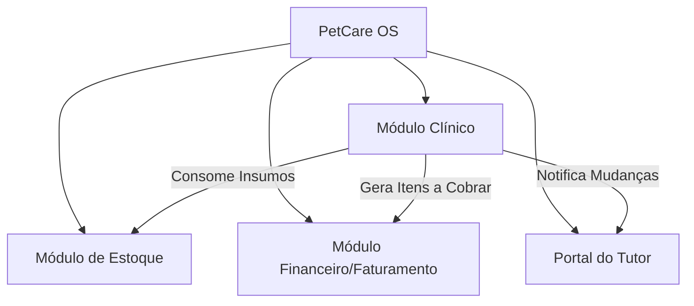

# 🐾 PetCare OS — Desafio Geral da Formação

Bem-vindo ao repositório central do **PetCare OS**, o projeto prático de portfólio que servirá como o principal **fio condutor** de toda a sua jornada de aprendizado nesta formação. 

Em vez de criar pequenos projetos isolados a cada módulo, você construirá um ecossistema de software completo e real do zero absoluto, aplicando gradualmente cada conceito estudado — desde os fundamentos de HTML/CSS até arquitetura de software, infraestrutura como código (IaC), observabilidade, conformidade com a LGPD e inteligência artificial generativa.

Ao final da formação, você terá um projeto extremamente robusto, documentado e em nível de produção para destacar no seu portfólio de engenharia de software.

---

## 📑 O Cenário de Negócio

Uma rede de clínicas veterinárias e petshops de médio porte, a **PetCare**, está com problemas para escalar suas operações. Atualmente, os processos de agendamento, triagem médica, controle de estoque de medicamentos controlados e comunicação com os tutores são feitos de forma fragmentada (planilhas de Excel, anotações de papel e mensagens manuais de WhatsApp).

Essa desorganização gera problemas graves:
- **Erros de priorização:** Dificuldade em triar emergências veterinárias de consultas rotineiras ou banho e tosa.
- **Falta de visibilidade para o cliente:** Tutores ligam constantemente para saber se o seu pet já terminou o banho ou acordou da cirurgia.
- **Descontrole de estoque:** Falta de rastreabilidade de vacinas e medicamentos de uso controlado (exigidos por órgãos reguladores).
- **Inconsistência financeira:** Lentidão na aprovação de orçamentos médicos complexos pelos tutores, atrasando procedimentos críticos.

### A Solução: PetCare OS
O **PetCare OS** será uma plataforma unificada que atende a dois públicos:
1. **Equipe Interna (Clínicos, Esteticistas, Recepcionistas e Administradores):** Dashboard para gerenciar o fluxo de atendimento, prontuários, estoque de insumos e faturamento.
2. **Tutores (Clientes):** Um portal de consulta externa rápido e dinâmico, onde acompanham o status do atendimento do pet em tempo real e aprovam orçamentos.

---

## 🧩 Os Domínios do Sistema

Para organizar o desenvolvimento e aplicar conceitos de **Domain-Driven Design (DDD)** e **Clean Architecture**, o PetCare OS é dividido em subdomínios claros:

### 1. Módulo Clínico (Atendimento, Triagem e Prontuários)
- **Triagem Inteligente:** Registro de sinais vitais (temperatura, frequência cardíaca, peso) e aplicação de um protocolo de triagem baseado em gravidade.
- **Prontuário Eletrônico:** Histórico médico contínuo do paciente (doenças anteriores, cirurgias, alergias e registro de vacinas aplicadas).
- **Ciclo de Estados do Atendimento:** O atendimento avança de forma estrita: 
  `Recebido ➡️ Em Triagem ➡️ Aguardando Aprovação (Orçamento) ➡️ Em Procedimento ➡️ Pronto para Alta ➡️ Finalizado`

### 2. Módulo de Estoque (Insumos e Medicamentos Controlados)
- **Catálogo Geral:** Cadastro de vacinas, medicamentos, insumos hospitalares e produtos de petshop.
- **Baixa Automática:** Ao finalizar uma consulta, cirurgia ou serviço de estética, o sistema dá baixa automática no estoque dos insumos associados.
- **Controle de Medicamentos Especiais:** Rastreabilidade estrita de medicamentos controlados (lote, data de validade e veterinário responsável pela prescrição).

### 3. Módulo Financeiro e Faturamento
- **Orçamentos Prévios:** Geração dinâmica de orçamentos contendo a soma de serviços (ex: consulta + exame) e insumos previstos (ex: anestésico, curativos).
- **Faturamento e Checkout:** Registro de pagamentos e controle de status de liquidação.

### 4. Portal do Tutor
- **Acompanhamento Visual:** Painel interativo sem necessidade de login complexo (acesso via token seguro enviado por e-mail ou link único), exibindo a etapa atual do pet (ex: "Em cirurgia", "Em banho e tosa", "Pronto para receber alta").
- **Aprovação de Orçamentos:** Interface para o tutor revisar e aprovar digitalmente a execução de procedimentos extras recomendados pelo clínico.

---

## 🗺️ O Fio Condutor: Mapa de Evolução do Projeto

Ao longo dos **26 módulos da formação**, você construirá o PetCare OS passo a passo. Abaixo está o mapeamento de como cada parte do currículo se conecta ao projeto prático:

| Módulos | Tema do Módulo | O Que Você Implementará no PetCare OS |
| :---: | :--- | :--- |
| **01 e 02** | Fundamentos da Web & Frontend Essencial | Criação da interface estática (HTML/CSS sem frameworks) do **Portal do Tutor** e do **Painel de Atendimentos** da clínica, focando em semântica, acessibilidade e design premium. |
| **03** | Programação com TypeScript | Escrita das regras de negócio básicas em TypeScript puro: modelos de dados (`Pet`, `Tutor`, `Service`, `StockItem`) e classes gerenciadoras. |
| **04** | Algoritmos e Estruturas de Dados | Implementação do algoritmo de **Triagem de Pacientes** utilizando uma **Fila de Prioridade (Priority Queue)** baseada na gravidade dos sintomas, idade e tempo de espera. |
| **05 e 06** | Ferramentas & Engenharia de Produto | Configuração do repositório no GitHub, definição de branches, pull requests com linters/formatadores, e escrita de Histórias de Usuário e Critérios de Aceite para o módulo financeiro. |
| **07 e 08** | Frontend Moderno & Next.js Fullstack | Criação do painel administrativo e do portal do tutor utilizando React e Next.js (App Router), conectando Server Components a uma estrutura interativa. |
| **09 e 10** | Bancos de Dados & Node.js Backend | Modelagem relacional no **PostgreSQL** com **Prisma ORM** (para persistir Tutores, Pets, Atendimentos e Financeiro) e uso do **MongoDB** para armazenar logs de telemetria dos pets e histórico bruto de auditorias clínicas. |
| **11** | API Design Profissional | Criação da API RESTful do backend (utilizando Fastify ou Express) documentada com **Open OpenAPI/Swagger**, filtros de busca avançados, paginação no catálogo de produtos e **chaves de idempotência** para evitar cobranças duplicadas em orçamentos. |
| **12** | Autenticação, Autorização e Segurança | Controle de acesso via **JWT** e regras de **RBAC (Role-Based Access Control)** diferenciando Clínicos, Recepcionistas e Administradores. Implementação de proteção contra XSS, CSRF, CORS e sanitização contra SQL Injection. |
| **13** | Qualidade, Testes e Observabilidade | Cobertura de testes unitários e de integração com Jest/Vitest. Criação de testes de carga com **k6** para simular picos de acessos no portal dos tutores. Instrumentação com Winston (logs), Prometheus (métricas) e OpenTelemetry. |
| **14 e 15** | Design e Arquitetura de Software | Refatoração do backend aplicando **SOLID, Clean Architecture** (camadas de Entidades, Casos de Uso, Gateways e Controladores) e **DDD (Domain-Driven Design)**, desenhando fronteiras lógicas explícitas entre os domínios. |
| **16** | Tempo Real & Comunicação Assíncrona | Atualização em tempo real do progresso do pet no Portal do Tutor usando **WebSockets (Socket.io)** ou **SSE**. Processamento em segundo plano com **BullMQ / Redis** para geração de PDFs de prontuários e envio de e-mails automáticos. |
| **17 e 18** | Cloud Fundamentals & IaC (Terraform) | Arquitetura de implantação na nuvem (AWS/GCP). Criação dos scripts em **Terraform** para provisionar de forma declarativa a rede (VPC), banco de dados (RDS PostgreSQL) e armazenamento de exames (S3). |
| **19** | DevOps, Containers e Kubernetes | Criação de Dockerfiles otimizados e pipelines de **CI/CD** no GitHub Actions. Definição de manifestos de **Kubernetes (k8s)** para deployment escalável, gerenciamento de segredos e escalabilidade automática (HPA). |
| **20** | SRE, Operação e Incidentes | Definição de SLOs e SLIs de disponibilidade e latência do fluxo de triagem, criação de runbooks operacionais e documentação de postmortem pós-falha simulada de banco de dados. |
| **21** | Supply Chain Security e Secure SDLC | Integração de varreduras SAST/DAST no pipeline de entrega contínua, auditoria de dependências NPM vulneráveis e geração automática de SBOM (Software Bill of Materials) da aplicação. |
| **22** | Privacidade e Governança de Dados | Aplicação de conformidade com a **LGPD**: logs de auditoria imutáveis para acesso a prontuários médicos, fluxo de consentimento explícito dos tutores, e fluxo de anonimização de dados pessoais para geração de relatórios administrativos. |
| **23** | System Design | Escalabilidade avançada da plataforma aplicando cache distribuído em **Redis** para a listagem de serviços da clínica, e desenho de uma arquitetura resiliente com padrões de disjuntor (*Circuit Breaker*) e fila de mensagens. |
| **24** | IA para Desenvolvedores | Integração de Inteligência Artificial Generativa: um **Assistente Clínico IA** (com RAG baseado em manuais veterinários públicos) para sugerir diagnósticos e contraindicações de medicamentos a partir dos sintomas triados, e um gerador de receitas médicas pré-formatadas. |
| **25** | Documentação Técnica | Escrita da documentação arquitetural completa do ecossistema: diagramas no padrão **C4 Model** (Contexto, Contêineres e Componentes) e escrita de **ADRs (Architecture Decision Records)** para fundamentar as principais decisões técnicas do projeto. |

---

## 🎯 Por que esse projeto destaca você no mercado?

Ao apresentar o **PetCare OS** para recrutadores ou em discussões de entrevistas técnicas, você não estará mostrando apenas uma "API de tarefas simples". Você demonstrará o domínio de um engenheiro de software sênior:

1. **Raciocínio de Negócio Real:** A aplicação resolve dores reais de logística, triagem de saúde, controle de estoque e conformidade jurídica (LGPD).
2. **Profundidade de Engenharia:** O portfólio comprova que você sabe construir testes de carga, projetar infraestrutura em nuvem via código (IaC), monitorar SLOs operacionais de produção e desenhar arquiteturas limpas desacopladas.
3. **Maturidade Tecnológica:** Em vez de usar IA apenas para gerar código de forma cega, você integrou modelos de linguagem (LLMs) como uma funcionalidade produtiva do sistema (RAG, validação clínica e automação inteligente).

*Prepare-se para construir um sistema robusto, elegante e profissional!*